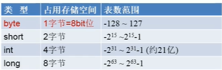
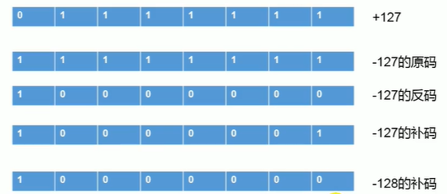

# [返回](/)

# 基本知识概述

## JAVA两种核心机制

- Java虚拟机
  - 跨平台的原因：不同的平台上有不同的JAVA虚拟机，”一次编译，到处运行“
- 垃圾收集机制

## JAVA主要特点

- 面向对象性
  - 两个要素：类、对象
  - 三个特征：封装、继承、多态
- 健壮性：去除C中的指针、自动垃圾回收等
- 跨平台性：一次编译，到处运行

## JDK、JRE

- JDK：提供给开发人员的工具包，包含JDK、JRE
- JRE：JAVA运行环境
- JAVA版本是向下兼容的，后面的版本是在前面的基础上新增功能

​															    JDK = JRE + 开发工具集（javac等）

​																JRE = JVM + JAVA SE标准类库

## JAVA的运行

## JAVA注释

- 单行：//
- 多行：/* */
- 文档：/** */，可以被javadoc.exe 解析，生成html文件

## JAVA关键字与保留字

- 关键字：JAVA中一些具有特殊含义的字符

- 保留字：当前JAVA版本中并未使用，但后续中可能会使用，自己命名时需要避开，比如goto、const

## JAVA标识符命名规范

下文xxx、yyy、zzz代表不同单词

- 包名：xxxyyyzzz
- 类、接口名：XxxYyyZzz
- 变量、方法名：xxxYyyZzz
- 常量名：XXX_YYY_ZZZ

## JAVA变量分类

### 按数据类型

> char：两字节

### 按所处位置

## 字符编码

- ASCII码：美国制定的英文字符与二进制位之间的对应关系的规定，如A=65，a=97等，共128个字符只占用一个字节的后面7位，第一位规定为0
- 编码集：UTF-8，GBK等

## 原码、反码和补码

> 计算机底层都用补码来存储数据，正数三码一致

> 计算机取相反数的过程，每个位取反，再加一，比如对于-3，-3==1111...1101，3==0000...0010+1==0000...0011
>
> 所以：Integer.MIN_VALUE == -Integer.MIN_VALUE

## 参考

[1] [尚硅谷JAVA——宋红康](https://www.bilibili.com/video/BV1Kb411W75N)

