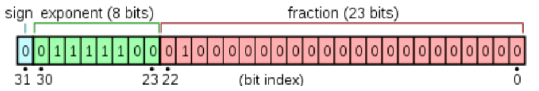
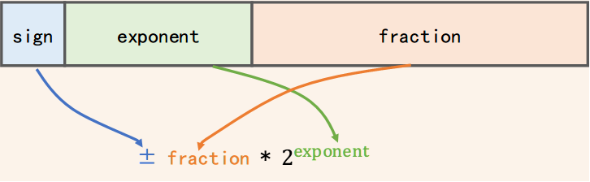
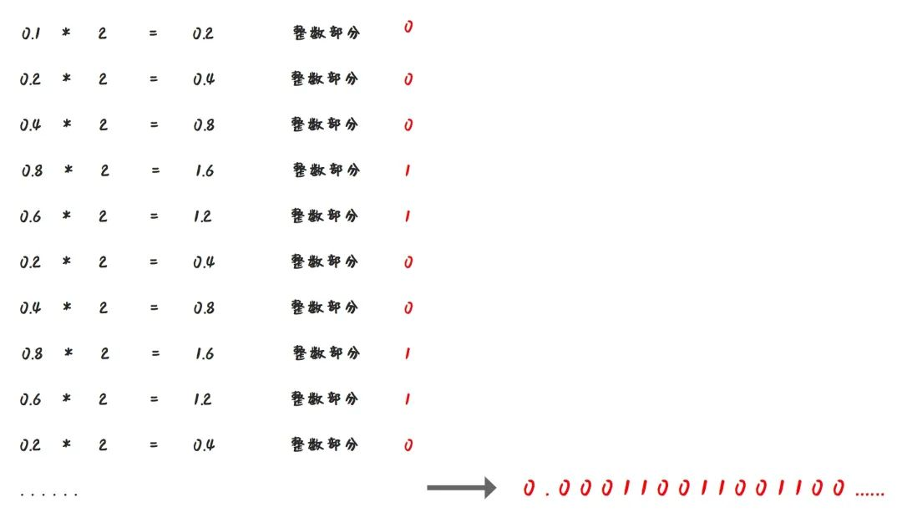
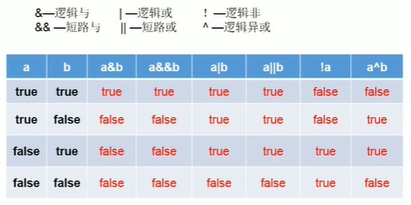
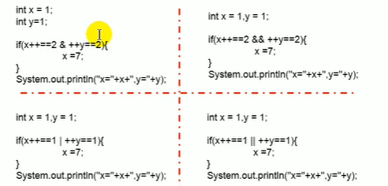
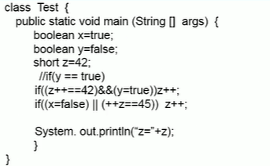
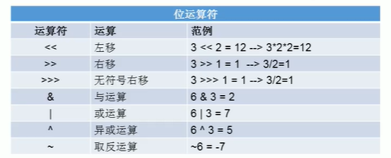
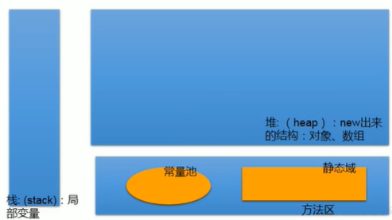
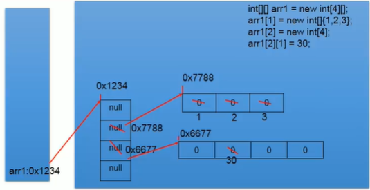

# [返回](/)

# JAVA语法

## 数据类型转换

- 自动类型提升

```java
byte b1 = 2;  // 注意，这里存在一个int到byte/char/short的隐式缩窄转换，只有赋值时可以
int i1 = 129;
short s1 = 10
byte b2 = b1 + i1;  //编译不通过
int i2 = b1 + i1;
float f1 = b1 + i1;
/*
byte/char/short -> int -> long -> float -> double
自动提升为容量大的数据类型
 */

short s2 = s1 + b1;  //编译不通过
// byte、char、short之间的相互运算自动转成int型，为了保证不溢出
// java在做运算的时候，如果操作数在int的范围之内，一律在int的空间内运算

long l1 = 21332423245234123;  // 编译不通过，后面未加L，自动令为int型

float f1 = 12.3;  //编译不通过，自动令为double型，需要加F或强制转换
```

- 强制类型转换

```java
double d1 = 12.9;
int i1 = (int)d1; // i1 == 12，截断操作
byte b1 = (byte)128; // b1 == -128，补码的知识
```

## 浮点数

> 整理笔记的过程中，发现对这个知识点一直理解的不充分，特拉出来单独整理一下

### 浮点数的存储

根据上面我们不难发现，同样是8字节，为什么double的范围要比long大？

这是由于存储方式不一样决定的，以float为例，它不止有符号位和数值位



**sign: 符号位, 即图中蓝色的方块**

- 符号位，表示浮点数的正负

**biased exponent: 偏移后的指数位, 即图中绿色的方块**

- 表示浮点数的范围

**fraction: 尾数位, 即图中红色的方块**

- 表示浮点数的精度

以上，为IEEE 754标准规定的浮点数存储方式，任何浮点数都可以表示为



这种科学计数法的形式，这里有几个需要注意的点

1. 尾数部分应当是1.xxxxx……，但1是默认隐含的，所以这23位全部用来表示小数点后面的部分，2^23=8388608，也就是说精度可以达到（1.0~1.8388608）* 2 ^ exponent，很容易看出来，7位以下的精度是完全可以保证的，7位的精度也有83.88608%可以保证，**因此，float的精度为6-7位**，IEEE 754中称之为单精度；同理，double型的尾数部分有52位，2^52=4503599627370496，所以15位的精度是完全可以保证的，16位的精度也有接近50%可以保证，**因此，double的精度为15-16位**，IEEE 754定义为双精度

2. float的指数部分有8位，根据IEEE 754的规定，可以表示[-127，128]之间的指数

   > 开始这里我也不是很理解，带符号的话不应该是-128~127吗？但这里不是这样的，IEEE 754就是规定了指数可以是[-127， 128]范围内，把这个和之前提到的-128~127当成完全无关的两个独立事件，至于为什么要这样规定，还没有进一步深究

   但是，有符号数的运算比无符号要复杂，因此根据IEEE的规定，指数位是要存无符号整数的，那么如何表示负数指数呢？这里IEEE 754定义了一个**偏移量127**，存储的时候是0~255，实际上代表的是存储的值减去这个偏移量，那么也就能够表示[-127，128]了，同理，double型的偏移量为1023

   > 负指数的意义，可以用来表达某个接近于0的数的

### 浮点数的运算

- 基本原则，先对齐指数位，再计算尾数位
- 浮点数运算的精度是不可保证的，因此不要认为0.2+0.1==0.3

> 经典的0.30000000000000004：
>
> 写一行简单的公式并打印，0.2+0.1，在各种语言中，我们可以发现结果都是0.30000000000000004
>
> 原因？
>
> 首先，计算机中的运算是基于二进制的，0.1的二进制表示是多少？
>
> 
>
> 根据IEEE 754中的双精度来计算，只能取一个双精度范围内的近似值
>
> 0.1 = 0.00011001100110011001100110011001100110011001100110011001
>
> 0.2 = 0.00110011001100110011001100110011001100110011001100110011
>
> 加起来就是0.30000000000000004啦
>
> 相关链接：[https://0.30000000000000004.com](https://0.30000000000000004.com/)

## 自增、自减

```java
int i1 = 6;
int i2 = i1++; // i2 = 6
i2 = ++i1; // i2 = 7
```

> ++、+=、*=等等，不会改变变量本身的数据类型，byte b = 127，++b = -128而不会是(int)128，int i = 10，i *= 0.1，结果为0
>
> 这是因为JVM自动做了一个类型转换

```java
int n = 10;
n += (n++) + (++n);
System.out.println(n);  // n = 32
// n = n + (n++) + (++n)
```

## 逻辑运算

```java
// 注意逻辑与/或和短路与/或的区别
boolean b = false;
int num = 10;
if(b & (num++));
System.out.println(num);  // num = 11
if(b && (num++));
System.out.println(num);  // num = 11，因为在b处直接短路了
```





> 左上. x=2, y=2     右上. x=2, y=1     左下. x=7, y=2     右下. x=7, y=1



>  z=46

## 位运算

> 注意左移时候的符号位问题，左移过多可能导致数值位移到符号位上，正数变负数

> 面试题：最高效的2 * 8？① 2 << 3  ② 8 << 1




> 不用临时变量交换num1和num2的值？
>
> ```java
> num1 = num1 ^ num2;  // num1 == num1 ^ num2, num2 == num2
> num2 = num1 ^ num2;  // num1 == num1 ^ num2, num2 == num1 ^ num2 ^ num2 == num1
> num1 = num1 ^ num2;  // num1 == num1 ^ num2 ^ num1 == num2, num2 == num1
> // 和0异或值不变，和自己异或值为0
> // 满足交换律和结合律
> // 可以看作无进位相加
> ```

## 三元运算符

> Object obj = true ? 1 : 2.0，这个式子的结果是1.0，为什么？
>
> 因为三元运算符冒号两边如果可以转换的话（基本数据类型或包装类之间），会统一成一个类型，所以存在一个int到double的类型提升

## 循环

> 带标签的循环控制（很长一段时间居然一直不知道这种写法……）

```java
int i = 0;
label: for(; i < 10; i++){
    for(int j = 0; j < 5; j++){
        if(j == 4) break label;
    }
}
System.out.println(i);
// i = 0
```

> 双指针写法，数组反转的例子

```java
for(int i = 0, j = arr.length - 1; i < j; i++, j--){
    exch(arr, i, j);
}
```

## 数组

> int[] x, y[]：这种写法这里的y是二维数组

### 数组的内存解析



> 垃圾回收：引用计数算法，计数堆中某个结构在栈中被引用的计数，计数为0则回收；具体看JVM部分

> 注意：常量池包括不同种类的常量，且JDK1.7后常量池有所改变，所以这个图不准确，仅供前期参考



> arr1是二维数组，元素值为堆中一维数组的首地址，初始化的默认值是null；一维数组则看它的数据类型
>
> 初始化时，先在堆中开辟空间，再用栈中的变量指向该空间

## 回调方法

```java
public class Testt {
    public static void main(String[] args) throws InterruptedException {
        new Person().registerWakeupService();
    }
}
interface Callback{
    void beWakeup();
}
class Person implements Callback{
    private Hotel hotel = new Hotel();
    @Override
    public void beWakeup() {
        System.out.println(this + " has been woke up");
    }
    public void registerWakeupService() throws InterruptedException {
        hotel.wakeupService(this);
    }
}
class Hotel{
    public void wakeupService(Callback callback) throws InterruptedException {
        System.out.println(callback + " register wakeup service");
        Thread.sleep(3000);
        callback.beWakeup();
    }
}
```

- 在Hotel里声明接受回调事件的方法wakeupService，当hotel有空时执行这个方法
- Person定义自己的回调方法
- 向回调方法的调用者hotel注册回调， registerWakeupService()，告诉hotel在适当的时间执行自己的回调，为了实现这个目的，要暴露出指向自己的引用

> [strategy](https://link.zhihu.com/?target=https%3A//en.wikipedia.org/wiki/Strategy_pattern)、[template](https://link.zhihu.com/?target=https%3A//en.wikipedia.org/wiki/Template_method_pattern)、[observer](https://link.zhihu.com/?target=https%3A//en.wikipedia.org/wiki/Observer_pattern)、[visitor](https://link.zhihu.com/?target=https%3A//en.wikipedia.org/wiki/Visitor_pattern)模式全部都是回调的不同应用
>
> [https://www.zhihu.com/search?type=content&q=java%20%E5%9B%9E%E8%B0%83](https://www.zhihu.com/search?type=content&q=java%20%E5%9B%9E%E8%B0%83)

## 参考

[1] [尚硅谷JAVA——宋红康](https://www.bilibili.com/video/BV1Kb411W75N)

[2] [IEEE754标准: 一 , 浮点数在内存中的存储方式——李平笙](https://zhuanlan.zhihu.com/p/343033661)

[3] [漫话：如何给女朋友解释为什么计算机中 0.2 + 0.1 不等于 0.3 ？——蛙课网](https://zhuanlan.zhihu.com/p/265281184)

[4] [https://0.30000000000000004.com](https://0.30000000000000004.com/)