## [返回](/)

# 排序算法合集

八大主要排序算法及JAVA实现版本

> **内排序和外排序**：根据在排序过程中待排序的记录是否全部被放置在内存中，排序分为：内排序和外排序
>
> - 内排序是在排序整个过程中，待排序的所有记录全部被放置在内存中
> - 外排序是由于排序的记录个数太多，不能同时放置在内存，整个排序过程需要在内外存之间多次交换数据才能进行
>
> 下面提到的都是内排序算法

**面试常考手撕冒泡、快排；了解归并、堆的思想**

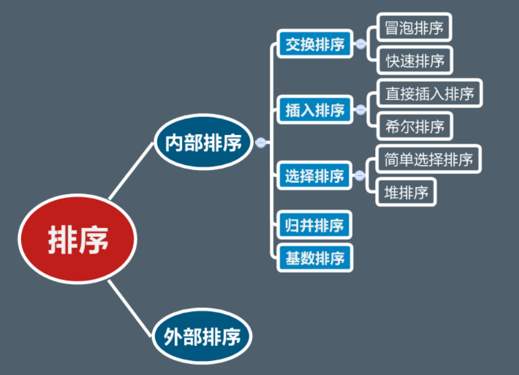

## 选择排序

> 每次从元素中选取最小的一个放在第一位，接着从剩下的元素中选取最小的放在第二位，依此类推

``` java
public static void selectSort(int[] arr){
    for(int i = 0; i < arr.length; i++){
        for(int j = i + 1; j < arr.length; j++){
            if(arr[j] < arr[i]) exch(arr, i, j);
        }
    }
}
```

- 空间复杂度：O(1)

> 不需要额外的数组空间

- 时间复杂度：O(N^2)

> 第一次比较N-1次，第二次比较N-2次，以此类推：N+(N-1)+...+1 = N*(N-1)/2

- 是否稳定：否

> 例如：对于[5,8,5,2,9]，第一个5因为与2交换，导致两个5的相对顺序发生改变了，因此是不稳定的

## 插入排序

> 从第一个元素开始，向前面的元素中合适的位置插入元素

1. 第一种实现：与前面的元素不断交换，把前面的大于当前元素值的元素换到后面来（本质上也就相当于把前面的大于当前元素值的元素右移）

```java
public static void insertSort(int[] arr){
    for(int i = 1; i < arr.length; i++){
        for(int j = i; j > 0; j--){
            if(arr[j] < arr[j - 1]){
            	exch(arr, j, j - 1);
            } 
        }
    }
}
```

2. 第二种实现：直接在合适的位置插入，并将后面的元素右移

```java
public static void insertSort(int[] arr){
    for(int i = 1; i < arr.length; i++){
        int temp = arr[i], j;
        for(j = i - 1; j >= 0; j--){
            if(arr[j] < temp) break;
            arr[j + 1] = arr[j];
        }
        arr[j + 1] = temp;
    }
}
```

- 空间复杂度：O(1)

> 不需要额外的数组空间

- 时间复杂度：最好O(N)，最坏O(N^2)

> 当数组完全有序时，只需要跟前一个元素比较，这样只需比较N-1次，而完全反序时，每次都需要比较到最前面的元素，即N*(N-1)/2次

- 是否稳定：是

> 例如，对于[6,5,5]，第一个5插入到6前面，第二个5插入到5、6之间，相对顺序没有变

## 希尔排序

> 当反序的元素隔的非常远时，比如[2,3,4,5,...,1]，这时候1要比较很多次，希尔排序比较好地解决了这个问题，将间隔大的优先处理，然后不断缩小间隔
>
> 
>
> 每个分组采用插入排序

```java
public static void shellSort(int[] arr){
    int h = 1;
    while(h < arr.length / 3) h = h * 3 + 1;
    while(h >= 1) {
        for (int i = 1; i < arr.length; i++) {
            int temp = arr[i], j;
            for (j = i - h; j >= 0; j-=h) {
                if (arr[j] < temp) break;
                arr[j + h] = arr[j];
            }
            arr[j + h] = temp;
        }
        h /= 3;
    }
}
//与插入排序相比，只是“1”变成了“h”而已
```

- 空间复杂度：O(1)

> 不需要额外的数组空间

- 时间复杂度：O(N^1.3-2)

>shell排序的时间复杂度是根据选中的 增量d 有关的，所以分析shell排序的时间复杂度是个比较麻烦的事；这里只给出答案，不推算了；
>
>在最优的情况下，时间复杂度为：O(N^(1.3))（元素已经排序好顺序）
>
>最差的情况下是O(N^2)

- 是否稳定：否

> 和插入排序不同，当分组间隔较大的时候，由于记录跳跃式的移动，希尔排序并不是一种稳定的排序方法

## 归并排序

> 要将一个数组排序，可以先将它分成两半分别排序，然后将结果归并起来

1. 自顶向下：将大数组分解成小数组，分别处理（递归）

```java
private static int[] copy;
public static void mergeSort(int[] arr){
    copy = new int[arr.length];
    mergeSort(arr, 0, arr.length - 1);
}
public static void mergeSort(int[] arr, int start, int end){
    if(end <= start) return;
    int mid = start + (end - start) / 2;
    mergeSort(arr, start, mid);
    mergeSort(arr, mid + 1, end);
    merge(arr, start, mid, end);
}
public static void merge(int[] arr, int start, int mid, int end){
    for(int index = start; index <= end; index++){
        copy[index] = arr[index];
    }
    int index1 = start, index2 = mid + 1;
    for(int index = start; index <= end; index++){
        if(index1 > mid) arr[index] = copy[index2++];
        else if(index2 > end) arr[index] = copy[index1++];
        else if(copy[index1] > copy[index2]) arr[index] = copy[index2++];
        else arr[index] = copy[index1++];
    }
}
```

2. 自底向上

```java
private static int[] copy;
public static void mergeSort(int[] arr){
    copy = new int[arr.length];
    int add = 1;  //子数组的大小
    while(add < arr.length) {
        for(int i = 0; i + add < arr.length; i += 2*add) {
            //归并[i:i+add-1]和[i+add:i+2*add-1]
            merge(arr, i, i + add - 1, Math.min(i + 2 * add - 1, arr.length - 1));
        }
        add *= 2;
    }
}
public static void merge(int[] arr, int start, int mid, int end){
    for(int index = start; index <= end; index++){
        copy[index] = arr[index];
    }
    int index1 = start, index2 = mid + 1;
    for(int index = start; index <= end; index++){
        if(index1 > mid) arr[index] = copy[index2++];
        else if(index2 > end) arr[index] = copy[index1++];
        else if(copy[index1] > copy[index2]) arr[index] = copy[index2++];
        else arr[index] = copy[index1++];
    }
}
```

- 空间复杂度：O(N)

> 需要一个额外的同等大小的数组

- 时间复杂度：O(NlogN)

> 每次归并都按顺序访问了一整个数组，是O(N)，归并次数为logN，所以为NlogN

- 是否稳定：是

> 归并时按顺序先后放入数组，相对顺序没有变

## 快速排序

> 平均时间最快的内排序算法，最坏情况下不如归并和堆排

> 原理很简单，选一个基准数，比它小的放左边，比它大的放右边（将左边比它大的和右边比它小的交换），再以基准数为划分，继续处理左右两个子数组

```java
public static void quickSort(int[] arr){
    quickSort(arr, 0, arr.length - 1);
}
public static void quickSort(int[] arr, int lo, int hi){
    if(lo >= hi) return;
    int pivot = arr[lo], i = lo, j = hi + 1;
    while (true){
        // arr[i] >= pivot或到末尾时跳出
            while(arr[++i] < pivot) if(i == hi) break;
            /*  针对i > j时的情况
                此时arr[i]要么等于末尾元素，说明左指针一直移到了末尾，也就是[lo+1, hi]的元素都比pivot小
                要么到达了pivot的右边，是右边的最小元素，也就是大于等于pivot的最小元素
             */
            // arr[j] <= pivot或到起点时跳出
            while(arr[--j] > pivot) if(j == lo) break;
            /*  针对i > j时的情况
                此时arr[j]要么等于起点元素，说明右指针一直移到了起点，也就是[lo+1, hi]的元素都比pivot大
                要么到达了pivot的左边，是左边的最大元素，也就是小于等于pivot的最大元素
             */
            // 所以当i > j时，arr[i]要么等于末尾元素，要么大于等于pivot
            // 而arr[j]要么等于起点元素，也就是pivot，要么小于等于pivot
            // 所以理所当然把j换到前面去
            // 为什么这里是>=，是因为数组中可能有pivot的重复元素
    }
    exch(arr, lo, j);
    quickSort(arr, lo, j - 1);
    quickSort(arr, j + 1, hi);
}
```

- 空间复杂度：O(logN~N)

> 每次分解用1个临时变量，所以最好的情况是O(logN)，最坏是O(N)

- 时间复杂度：最好O(NlogN)，最坏O(N^2)

> 每次都要遍历一遍数组，如果是最好的情况，每次恰好五五分，那么一共分解logN次，所以是O(NlogN)；如果是最坏的情况，已排序的数组，每次分解后较大那个数组都只去掉了一个元素，即要分解N次，O(N * N) = O(N^2)

- 是否稳定：否

> 大范围交换，打破稳定性

**快排和归并都是O(NlogN)，为什么选择快排？**

> 算法的每一步实际上都需要一个固定时间量，被称为常量。平时考虑时间复杂度的时候并不考虑常量的影响，但有时候常量的影响不可忽略，比如在这个问题上。而快排的常量比归排小，因此虽然两者的复杂度相同，但是快排更快一些
>
> *对于数组排序，快排是in-place的排序算法，而归排为out-place的排序算法，期间存在O(n)的空间复杂度，这就意味着对内存的拷贝释放等底层操作，有额外时间开销，所以快排>归排。但是对于链表而言，节点无规则分布在内存中，靠指针维系着关系，此时二者排序均可理解为in-place的方式，所以归排>快排*

**快排改进**

> 改进：小数组时效率不如插入排序，可以在小数组时切换至插入排序，大小可以取5~15之间的任意值

## 冒泡排序

> 遍历数组，每次比较相邻的元素，并把大的交换到后面，这样，第一趟将最大的元素换到最后面，第二趟将第二大的元素换到倒数第二位，以此类推

```java
public static void bubbleSort(int[] arr){
    for (int i = arr.length - 1; i >= 0; i--){
        for(int j = 0; j < i; j++){
            if(arr[j + 1] < arr[j]) exch(arr, j, j + 1);
        }
    }
}
```

- 空间复杂度：O(1)

> 没有使用额外的数组空间

- 时间复杂度：O(N^2)

> 第一次比较N-1次，第二次比较N-2次，以此类推：N+(N-1)+...+1 = N*(N-1)/2

- 是否稳定：是

> 冒泡的时候，相等元素不交换，是稳定的

## 堆排序

> **堆的定义**
>
> - 堆中某个节点的值总是不大于或不小于其父节点的值
> - 堆总是一棵完全二叉树
>
> **将根节点最大的堆叫做最大堆或大根堆，根节点最小的堆叫做最小堆或小根堆**

### 堆的构造（以大根堆为例）

> **堆的下沉**
>
> 这里给出一个例子，对于序列[1, 3, 5, 6, 4, 2]，首先按顺序构建一个二叉树，某个节点的下标为x，它的父节点为(x-1)/2，左子树为2\*x+1，右子树为2\*(x+1)
>
> 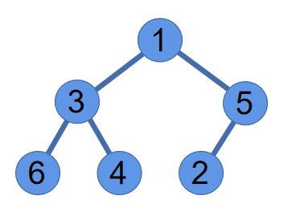
>
> **可以看出，这不满足大根堆的定义，需要进行“下沉”操作，使之满足大根堆的结构**
>
> 从最后一个非叶节点开始，往前遍历
>
> 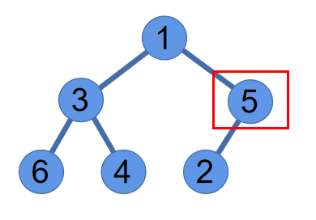
>
> 5及它的子结点满足堆的定义
>
> 继续往前，发现3不满足大根堆的定义，与左右子树中较大的那个交换
>
> 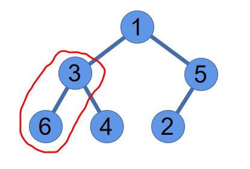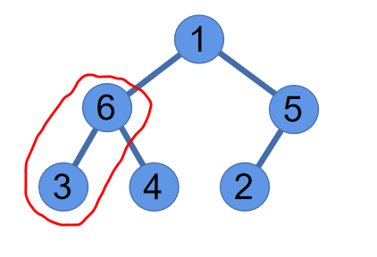
>
> 继续往前，发现1不满足大根堆的定义，与左右子树中较大的那个交换
>
> 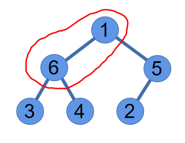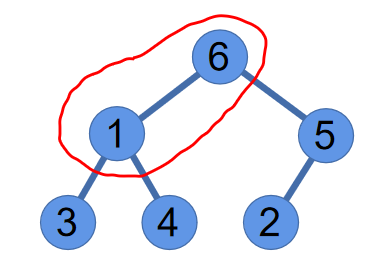
>
> 发现1又不满足大根堆的定义了，继续“下沉”
>
> 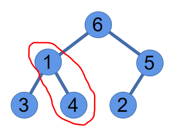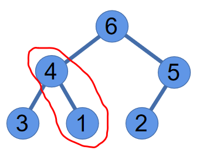
>
> 至此一个大根堆构造完成，序列变为[6, 4, 5, 3, 1, 2]
>
> 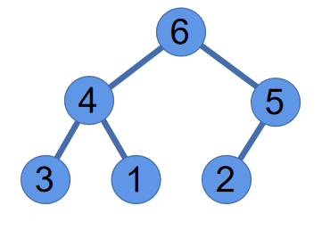

```java
public static void sink(int[] arr, int i, int bound){
    int leftChild = 2 * i + 1, rightChild = 2 * i + 2;
    // 为了后面的计算，这里添加一个bound边界，大于bound的元素不被计算
    if(leftChild >= bound) return;
    // 找出左右子树中较大的那个
    int bigger = (rightChild >= bound || arr[leftChild] > arr[rightChild]) ? leftChild : rightChild;
    if(arr[bigger] < arr[i]) return;
    // 如果大于当前节点，则交换
    exch(arr, bigger, i);
    // 继续看交换后的节点需不需要下沉
    sink(arr, bigger, bound);
}
```

```java
/* 
构造初始堆，i是当前最后一个叶节点的下标，那么它的父节点就是(i - 1) / 2，即最后一个非叶节点
*/
for(int i = arr.length - 1; i >= 0; i--){
    sink(arr, (i - 1) / 2, arr.length);
}
```

### 下沉排序（以大根堆为例）

> 将大根堆根节点与最后一个节点互换，那么最后一个节点一定是最大的那个值，这个位置的值便可以确定了
>
> 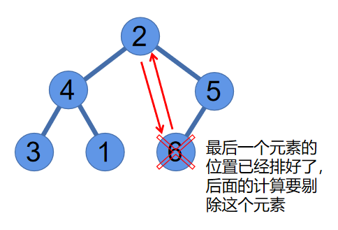
>
> 接着利用下沉将除了最后一个节点的剩余节点生成一个新的大根堆**（注意：这里只需要对根节点进行重建就可以了，因为只有根节点处不满足堆结构）**，再执行相同的操作，以此类推，直到排序完成
>
> 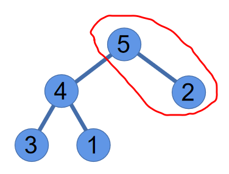
>
> 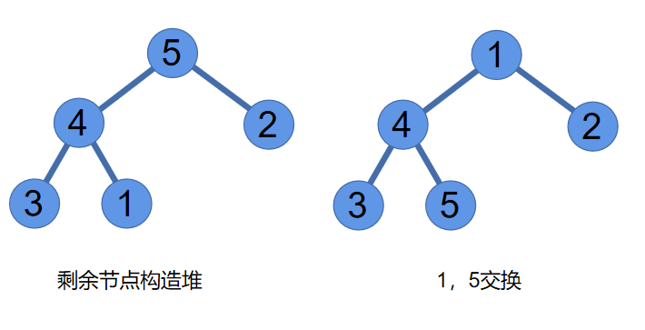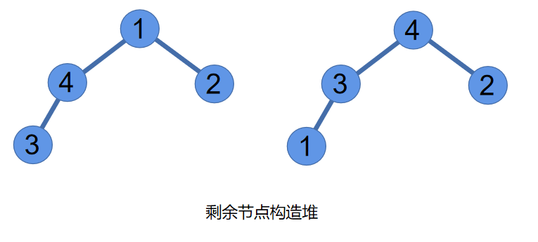
>
> **......（以此类推）**

```java
for(int i = arr.length - 2; i > 0; i--){
    // 根节点处重新生成堆
    sink(arr, 0, i + 1);
    // 交换根节点和最后一个节点，注意：这一步要在建堆后面
    exch(arr, i, 0);
}
```

**完整实现**

```java
public static void sink(int[] arr, int i, int bound){
    int leftChild = 2 * i + 1, rightChild = 2 * i + 2;
    if(leftChild >= bound) return;
    int bigger = (rightChild >= bound || arr[leftChild] > arr[rightChild]) ? leftChild : rightChild;
    if(arr[bigger] < arr[i]) return;
    exch(arr, bigger, i);
    sink(arr, bigger, bound);
}
public static void heapSort(int[] arr){
    // 建初始堆
    for(int i = arr.length - 1; i >= 0; i--){
        sink(arr, (i - 1) / 2, arr.length);
    }
    exch(arr, 0, arr.length - 1);
    for(int i = arr.length - 2; i > 0; i--){
        sink(arr, 0, i + 1);
        exch(arr, i, 0);
    }
}
```

- 空间复杂度：O(1)

> 没有使用额外的数组空间

- 时间复杂度：O(N^2)

> **构造初始堆**
>
> 设元素个数为n，则堆的高度k=log(N+1)，非叶子结点的个数为2^(k-1)-1
>
> 假设每个非叶子结点都需要进行调整，则第i层的非叶子结点需要的操作次数为k-i，
>
> 第i层共有2^(i-1)个结点，则第i层的所有结点所做的操作为(k-i)*[2^(i-1)]，
>
> 共k-1层非叶子结点，总的操作次数为 
>
> 
>
> 化简得2^k-k+1=N+1-log(N+1)+1，O(N+1-log(N+1)+1) ≈ O(N)
>
> **下沉排序**
>
> 当有N个节点时，树高为log(N+1)，重建需要的比较次数为
>
> log(N-1)+log(N-2)+...+log1≈O(NlogN)
>
> O(N)+O(NlogN)=O(NlogN)

- 是否稳定：否

> 初始化堆和排序时都有可能交换元素的顺序

## 基数排序

> 思想：取不同的位数，每个位数上排序
>
> - LSD：从右往左
> - MSD：从左往右


## 参考

[1]《算法4》

[2] [https://blog.csdn.net/zhanshen112/article/details/85211505](https://blog.csdn.net/zhanshen112/article/details/85211505)——吉大秦少游

[3] [https://www.cnblogs.com/lylhome/p/13276081.html](https://www.cnblogs.com/lylhome/p/13276081.html)——__lyl